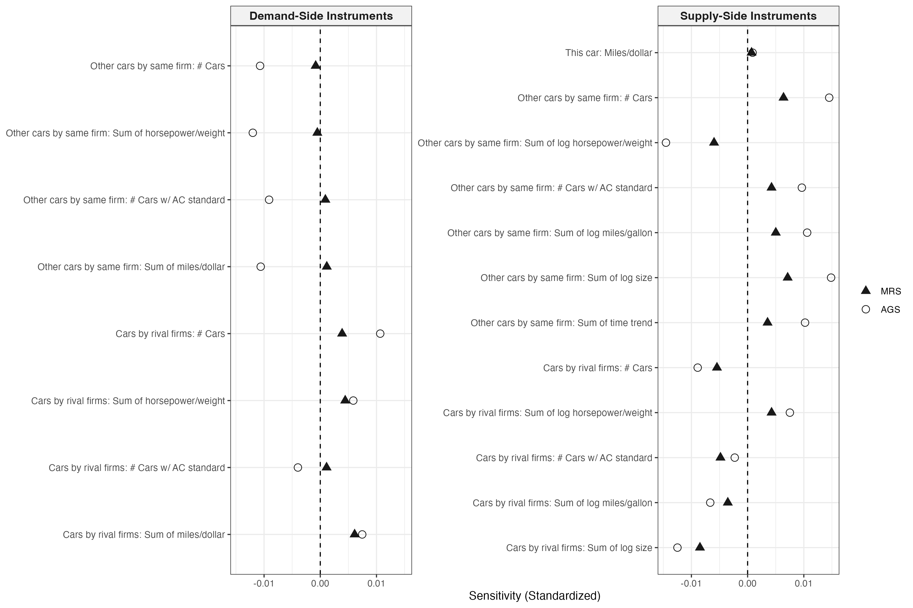
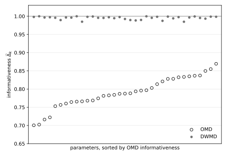
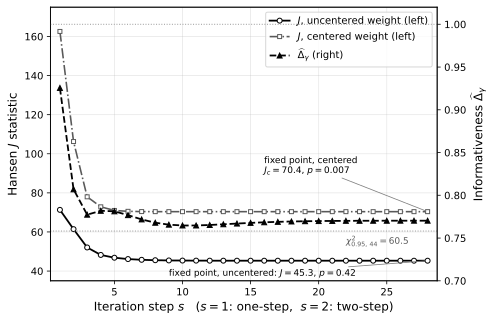
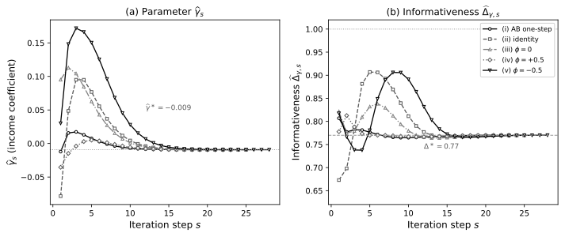
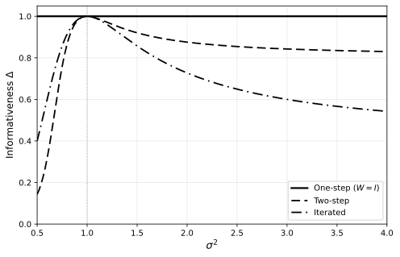

## Motivation

- Sensitivity to model specification is central to assessing the **robustness** of empirical conclusions.

- Reduced form: a rich, standardized toolkit to check omitted variable bias formula. [@rosenbaum1983assessing; @imbens2003sensitivity; @oster2019unobservable; @cinelli2020making]

- Structural estimators: [far less standardized]{.alert}.
    - the map from moment conditions to parameters is implicit and nonlinear;
    - misspecification is prevalent in applied work.

## Sensitivity is a local robustness diagnostic

- **Sensitivity** [@andrews2017measuring, AGS]: how $\widehat\theta$ responds to each estimation moment.

- A [local]{.alert} deviation of the moments, evaluated at [correct specification]{.alert}.

- But the $J$-test rejects strongly: the moments are [globally (fixed) misspecified]{.alert}.

## Sensitivity diagnostics meet misspecification

- The $J$-test rejects in practice:
    - @berry1995automobile (BLP): $J = 345$ (df $25$).
    - @blundell2008consumption (BPP): $J = 539$ (df $290$).

- Misspecification $\Rightarrow \widehat\theta$ converges to the [pseudo-true value]{.purple} $\class{purple}{\theta_0}$, the unique minimizer of the GMM criterion, with

$$\class{alert}{g} = \mathbb{E}[g(X_i,\theta_0)] \neq 0.$$

- [Extend AGS: sensitivity as a local deviation around the fixed-misspecified $\theta_0$.]{.alert}

## Setup

- Sample moments $\widehat{g}(\theta)$.

- Joint asymptotic distribution of the estimator and the moments:

$$\sqrt{n}\begin{pmatrix} \widehat\theta - \theta_0 \\ \widehat g(\theta_0) - g \end{pmatrix}
\rightsquigarrow
\begin{pmatrix} \widetilde\theta \\ \widetilde g \end{pmatrix}
\sim
\mathcal{N}\!\left(0,\; \begin{pmatrix} \sigma_{\theta\theta} & \sigma_{\theta g} \\ \sigma_{g\theta} & \sigma_{gg} \end{pmatrix}\right).$$

::: {.definition}
::: {.theorem-title}
Definition 1 *(misspecification-robust sensitivity, MRS)*
:::
$$\class{teal}{\Lambda} = \sigma_{\theta g}\,\sigma_{gg}^{-1} \qquad (p \times q).$$
:::

In the limit, $\mathbb{E}[\widetilde\theta \mid \widetilde g] = \Lambda\,\widetilde g$: the regression coefficient of the estimator on the moments.

Correct specification: $\quad \class{teal}{\Lambda} = -(G'WG)^{-1}G'W$ (AGS).

## Sensitivity requires the influence function

- Asymptotically linear representation:

$$\sqrt{n}(\widehat\theta - \theta_0) = \frac{1}{\sqrt{n}}\sum_{i=1}^n \psi(X_i) + o_p(1),
\qquad \class{teal}{\nu_i} = g(X_i,\theta_0) - g.$$

- Then $\class{teal}{\Lambda} = \mathbb{E}[\psi\nu']\,\mathbb{E}[\nu\nu']^{-1}$: we need $\psi(X_i)$ [at the pseudo-true value]{.purple}.

- Correct specification: $\psi_i = \Lambda_{AGS}\,\nu_i$.

- Misspecification ($\class{alert}{g} \neq 0$): sampling variation in the Jacobian $\widehat G$ and the estimated weight $\widehat W(\widehat\phi)$, with $\widehat\phi$ a first-step estimator, enters $\psi$ at first order, through influence functions $\class{alert}{\gamma_i}$, $\class{alert}{\omega_i}$, $\class{alert}{\psi^\phi}$.

::: {style="text-align: center;"}
[Proposition 1 derives $\psi$ and these channels.]{.alert}
:::

## Channel decomposition {#channels}

::: {.proposition}
::: {.theorem-title}
Proposition 1 *(decomposition of GMM influence functions)*
:::
One-step GMM with estimated weight $\widehat W$:
$$\psi^{1s,W}(X_i) = -A^{-1}\Big[\,
\underbracket[1pt]{\class{teal}{G'W(g_i - g)}}_{\class{teal}{\text{moment}}}
+ \underbracket[1pt]{\class{alert}{(g'W \otimes I_p)\,\gamma_i}}_{\class{alert}{\text{Jacobian}}}
+ \underbracket[1pt]{\class{alert}{(g' \otimes G')\,\omega_i}}_{\class{alert}{\text{weight matrix}}}
\,\Big].$$

Two-step adds $B\psi^\phi(X_i)$ *inside the bracket*; iterated replaces $A^{-1}$ by $(A+B)^{-1}$.
:::

::: {.definition}
::: {.theorem-title}
Definition 2 *(informativeness)*
:::
$$\class{teal}{\Delta_k} = \frac{\sigma_{\theta_k g}\,\sigma_{gg}^{-1}\,\sigma_{g\theta_k}}{\sigma_{\theta_k\theta_k}}
\;=\; R^2 \text{ of } \widehat\theta_k \text{ on the moments} \;\in [0,1].$$
:::

## Informativeness, and when $\Delta_k < 1$

- We interpret informativeness as **structural efficiency**: the proportion of the asymptotic variance explained by the moments.

- Extends @andrews2020informativeness; they derive $\class{teal}{\Delta_k} = 1$ under correct specification.

- $\class{teal}{\Delta_k} < 1$ when the Jacobian channel, the weight-matrix channel, or the preliminary-estimator channel matter.

- $\class{teal}{\Delta_k}$ vs. the $J$-test.

## Optimal minimum distance {#omd}

*(Proposition 2 in the paper)*

- Minimum distance, $g(X_i,\theta) = m_i - f(\theta)$, with the optimal weight $\widehat W = \widehat V^{-1}$.

- Jacobian is nonrandom and there is no first step.

- Only the [weight-matrix channel]{.alert} survives: we show

$$\psi_i = M_\nu\nu_i\,(1 - \nu_i'W\class{alert}{g}).$$

- Under Gaussian moments, we show:

$$\class{teal}{\Delta_k} = \frac{1}{1 + g'Wg}.$$

- [The optimal weight buys efficiency at the price of informativeness.]{.alert}

## The weighting ladder

$V = I_q$, Gaussian, common misspecification $g_k = \delta$. Same population weight; differ in how much is [estimated]{.alert}:

$$\underbracket{\class{teal}{\Delta_k^{OMD}} = \frac{1}{1 + q\delta^2}}_{\text{optimal weight}}
\qquad
\underbracket{\class{teal}{\Delta_k^{DWMD}} = \frac{1}{1 + 2\delta^2}}_{\text{diagonal}}
\qquad
\underbracket{\class{teal}{\Delta_k^{EWMD}} = 1}_{\text{identity}}.$$

 

- OMD channel [grows with $q$]{.alert}; in BPP, $q = 325$.

- Asymptotic counterpart of @altonji1996small.

## Sensitivity to the first step, and iteration {#iteration}

::: {.proposition}
::: {.theorem-title}
Proposition 3 *(sensitivity to the first-step estimator)*
:::
$$\Lambda_\phi = \operatorname*{plim}\, \frac{\partial\,\widehat\theta(\widehat\phi)}{\partial\widehat\phi'} = -A^{-1}\class{purple}{B}.$$
:::

## Iterated GMM as a fixed point {#fixedpoint}

::: {.proposition}
::: {.theorem-title}
Proposition 4 *(geometric convergence of iterated GMM)*
:::
For every $\tilde\rho \in (\rho(-A^{-1}B), 1)$, there is $C_{\tilde\rho}$ with
$$\big\|\psi^{ss}(X_i) - \psi^{it}(X_i)\big\|_{L^2(P)} \le C_{\tilde\rho}\,\tilde\rho^{\,s-1}.$$
Hence $\operatorname{Var}(\psi^{ss}) \to \operatorname{Var}(\psi^{it})$ and $\class{teal}{\Delta_k^{ss}} \to \class{teal}{\Delta_k^{it}}$ at the same rate.
:::

- @hansen2021inference show convergence of the iterated estimand/estimator.

- This proposition shows the convergence holds for the influence function and the variance as well.

## Three applications

| | Jacobian $\class{alert}{\gamma_i}$ | weight channel | iteration |
|:--|:-:|:-:|:-:|
| BLP | large | active | yes |
| BPP | $= 0$ | active | none |
| AJRY | modest | active | yes |

 

- BLP: misspecification reorders *sensitivity*.

- BPP: the *choice of weight* as an efficiency--informativeness trade.

- AJRY: $J$ and $\class{teal}{\Delta}$ *disagree*.

## BLP: sensitivity reorders

{width="52%" fig-align="center"}

- AGS (hollow) vs. MRS (filled) for the average markup.

- $\class{teal}{\widehat\Delta_{markup}} = 0.56$, $\;J = 345$ ($p$-value $< 0.001$).

## BPP: three weights, same moments

::: {style="text-align: center; font-size: 0.85em;"}
$35$ parameters, $q = 325$, $n = 1{,}765$, $J = 538.7$ (df $290$).
:::

| | $\widehat\phi$ (permanent) | SE | $\class{teal}{\widehat\Delta}$ | $\widehat\psi$ (transitory) | SE | $\class{teal}{\widehat\Delta}$ |
|:--|--:|--:|--:|--:|--:|--:|
| OMD | $0.33$ | $0.043$ | $\class{teal}{0.79}$ | $0.07$ | $0.039$ | $\class{teal}{0.79}$ |
| DWMD | $0.68$ | $0.113$ | $\class{teal}{0.99}$ | $0.03$ | $0.043$ | $\class{teal}{0.99}$ |
| EWMD | $0.61$ | $0.109$ | $\class{teal}{1.00}$ | $0.00$ | $0.049$ | $\class{teal}{1.00}$ |

## BPP: efficiency vs. informativeness

{width="56%" fig-align="center"}

::: {style="text-align: center;"}
OMD $\class{teal}{0.70}$--$\class{teal}{0.87}$; $\;$ DWMD $\class{teal}{\approx 0.99}$; $\;$ EWMD $\class{teal}{= 1}$. $\quad$ SE($\phi$): $0.043 \to \class{alert}{0.113}$.
:::

## AJRY: income and democracy {.smaller}

::: {style="text-align: center; font-size: 0.85em;"}
Difference GMM, $n = 127$ countries, df $44$; coefficient $\gamma$.
:::

| estimator | $\widehat\gamma$ | $J$ | $p$ | $\class{teal}{\widehat\Delta_\gamma}$ |
|:--|--:|--:|--:|--:|
| one-step (AB weight) | $-0.129$ | $\class{alert}{71.3}$ | $\class{alert}{0.006}$ | $\class{teal}{0.93}$ |
| two-step efficient | $-0.012$ | $\class{alert}{61.4}$ | $\class{alert}{0.04}$ | $\class{teal}{0.81}$ |
| iterated fixed point | $-0.009$ | $45.3$ | $0.42$ | $\class{teal}{0.77}$ |

- Efficient weight [lowers]{.alert} $\widehat\Delta_\gamma$: $0.93 \to 0.81 \to 0.77$.

- $J$ stops rejecting (uncentered efficient weight).

- Sensitive to the choice of uncentered/centered efficient weight:

$$J = 45.3\,(p{=}0.42) \;\text{ vs. }\; J_c = \class{alert}{70.4}\,(p{=}\class{alert}{0.007}), \qquad J = J_c/(1 + J_c/n).$$

## AJRY: $J$ turns on a centering convention; $\Delta$ does not

{width="60%" fig-align="center"}

::: {style="text-align: center;"}
$\class{teal}{\widehat\Delta_\gamma} = 0.77$, $\;J = 45.3$, $\;J_c = 70.4$.
:::

## $J$ and $\Delta$ are complements

| | $J$ under iteration | $\class{teal}{\widehat\Delta}$ under iteration | |
|:--|:-:|:-:|:--|
| BLP | flat at $345$ | $0.56 \to 0.24$ | $J$ silent, $\Delta$ falls |
| BPP | no iteration | $0.79\,/\,0.99\,/\,1$ | how to weight matters |
| AJRY | $61.4 \to 45.3$ | $0.81 \to 0.77$ | $J$ verdict flips, $\Delta$ falls |

 

- $J$: how far are the moments from zero?

- $\class{teal}{\Delta}$: how much of the variance do the moments explain?

## Takeaways

1. Robust to misspecification: evaluate sensitivity and informativeness [at the pseudo-true value]{.purple}.

2. Sensitivity rankings can reorder (BLP).

3. Weight choice in MD estimation is an efficiency--informativeness trade (BPP).

4. Reporting $\class{teal}{\widehat\Delta_k}$ is straightforward if you calculate misspecification-robust standard errors: it is free and answers what the $J$-test cannot (AJRY).

## Appendix: Assumption 1 (regularity) {#app-assumption data-visibility="uncounted" .smaller}

::: {.assumption}
::: {.theorem-title}
Assumption 1 *(regularity)*
:::
(i) $\{X_i\}_{i=1}^n$ i.i.d.
(ii) $\Theta \subset \mathbb{R}^p$ compact; unique interior minimizer $\class{purple}{\theta_0}$ of the population objective.
(iii) $g(X,\cdot)$ thrice continuously differentiable; $\mathbb{E}\sup_\theta\|g\|^2,\, \mathbb{E}\sup_\theta\|G\|^2 < \infty$, and uniform $L^2$ ($L^1$) bounds on second (third) derivatives.
(iv) curvature matrices $\class{purple}{A}$ and $\class{purple}{A + B}$ nonsingular.
(v) (iterated GMM) the population updating map is a contraction at $\theta_0$ ($\rho(-A^{-1}B) < 1$).
(vi) weight conditions: (a) one-step, $\widehat W \xrightarrow{p} W \succ 0$, $\sqrt{n}\,\operatorname{vec}(\widehat W - W) = n^{-1/2}\sum_i \omega_i + o_p(1)$; (b) parameter-dependent, $\widehat\phi \xrightarrow{p} \phi_0$ asymptotically linear, $W(\phi)$ smooth with uniform convergence of $\widehat W(\phi)$ and its derivative.
:::

Return to:

::: {.nav-buttons}
[[Prop 1](#channels)]{.back-btn}
[[Prop 2](#omd)]{.back-btn}
[[Prop 3](#iteration)]{.back-btn}
[[Prop 4](#fixedpoint)]{.back-btn}
:::

## Appendix: Notation {#app-notation data-visibility="uncounted" .smaller}

- Primitives: $\;g = \mathbb{E}[g(X_i,\theta_0)]$, $\quad G = \mathbb{E}\big[\partial g(X_i,\theta_0)/\partial\theta'\big]$, $\quad W = \operatorname{plim}\widehat W$.

- Channels: $\;\class{teal}{\nu_i} = g(X_i,\theta_0) - g$, $\quad \class{alert}{\gamma_i} = \operatorname{vec}\big(G(X_i,\theta_0)' - G'\big)$, $\quad \class{alert}{\omega_i} =$ influence function of $\widehat W$, $\quad \class{alert}{\psi^\phi} =$ influence function of the first-step $\widehat\phi$.

- Curvature: $\;R = \mathbb{E}\big[\partial_{\theta'}\operatorname{vec}(G(X_i,\theta_0)')\big]$, $\quad H = (g'W \otimes I_p)R$, $\quad \class{purple}{A} = G'WG + H$.

- Iteration: $\;S = \partial_{\phi'}\operatorname{vec} W(\phi_0)$ (two-step) or $\partial_{\theta'}\operatorname{vec} W(\theta_0)$ (iterated), $\quad \class{purple}{B} = (g' \otimes G')S$.

- Coefficient maps: $\;M_\nu = -A^{-1}G'W$, $\quad M_\gamma = -A^{-1}(g'W \otimes I_p)$, $\quad M_\omega = -A^{-1}(g' \otimes G')$.

Return to:

::: {.nav-buttons}
[[Prop 1](#channels)]{.back-btn}
[[Prop 3](#iteration)]{.back-btn}
:::

## Appendix: AJRY multistart, common fixed point {data-visibility="uncounted"}

{width="80%" fig-align="center"}

::: {style="text-align: center; font-size: 0.85em;"}
$\widehat\gamma_s$ and $\class{teal}{\widehat\Delta_{\gamma,s}}$ reach the common fixed point from every start; the approach of $\Delta$ is non-monotone.
:::

## Appendix: Schennach closed form {data-visibility="uncounted"}

{width="56%" fig-align="center"}

::: {style="text-align: center; font-size: 0.85em;"}
@schennach2007point: normal mean with misspecified variance restriction; closed-form $\class{teal}{\Delta}$ for one-step, two-step, iterated, CUE.
:::

## References {data-visibility="uncounted"}

::: {#refs}
:::
